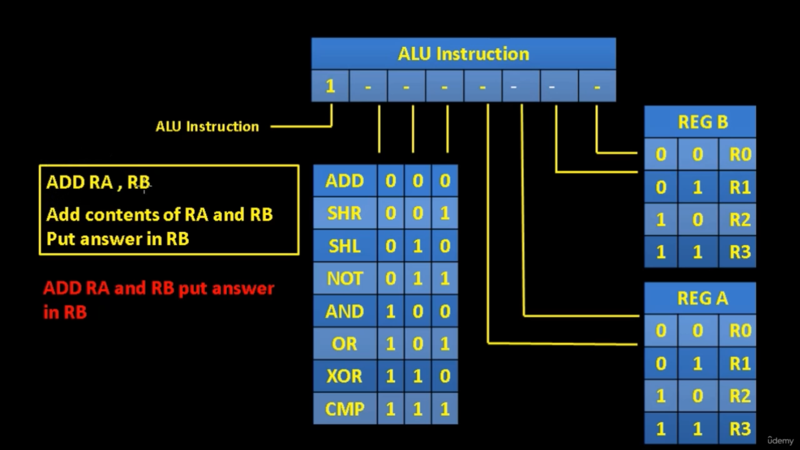
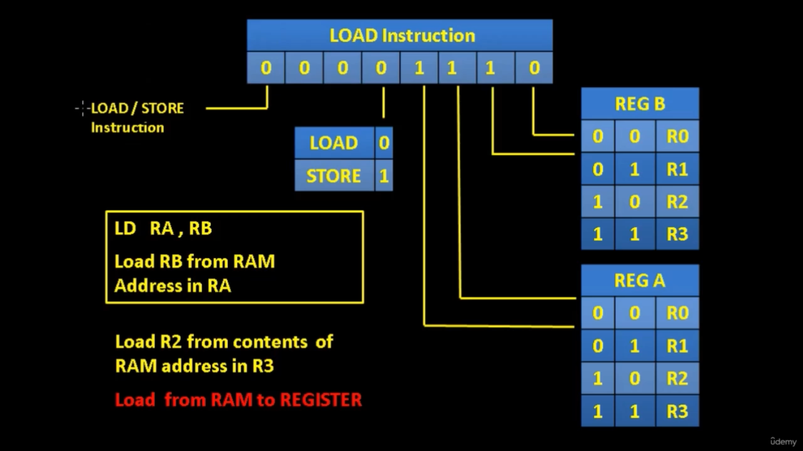

# Control section

* ### Fetch cycle

1. IAR e , MAR s , BUS1 , ACC s
2. RAM e , IR s
3. ACC e , IAR s

* ### ALU

1. REG A e , TMP s
2. ALU decoder , REG B e , ACC s , FLAG s
3. ACC e , REG B s

* ### STORE

1. REG A e , MAR s
2. RAM e , REG B s

* ### LOAD

1. REG A e , MAR s
2. REG B e , RAM s

* ### DATA

1. IAR e , BUS1 , ACC s , MAR s
2. RAM e , REG B s
3. ACC e , IAR s

* ### JMPR

1. REG B e , IAR s

* ### JMP

1. IAR e , MAR s
2. RAM e , IAR s

* ### JUMP IF

1. IAR e , MAR s , BUS1 , ACC s
2. ACC e , IAR s
3. ( RAMe e , IAR s ) : IF

* ### CLF

* ### END

